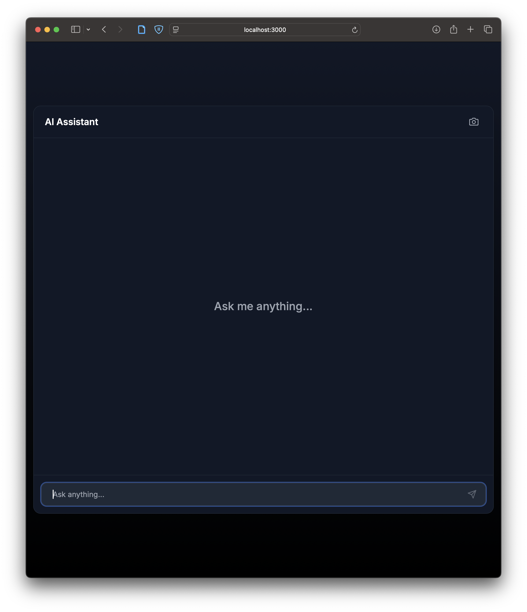

# Deepseek-R1 Chat Assistant

A chat assistant built with Next.js that uses Tavily for web search and DeepSeek for natural language processing. Features include streaming responses, reasoning explanations, source citations, and full chat screenshot capability.





## Features

- 🤖 Deepseek-R1-powered chat interface
- 🔍 Real-time web search integration
- 💭 Detailed reasoning for each response
- 📸 Full chat screenshot functionality
- ⚡ Streaming responses
- 🎨 Modern, responsive UI

## Prerequisites

Before you begin, ensure you have installed:
- [Node.js](https://nodejs.org/) (v18 or higher)
- npm or yarn

You'll also need API keys from:
- [Tavily](https://tavily.com) for web search functionality
- [DeepSeek](https://deepseek.com) for the AI language model

## Installation

1. Clone the repository:
2. Install dependencies (`npm install`)
3. Create a `.env.local` file with your API keys:
    ```
    TAVILY_API_KEY=your_tavily_api_key_here
    DEEPSEEK_API_KEY=your_deepseek_api_key_here
    ```
4. Run the development server: `npm run dev`

This will start the application at `http://localhost:3000`.

## Usage

- Start a chat by entering a query in the input field.
- The assistant will respond with a streaming reasoning, answer, and source citations (if specified).
- You can take a full screenshot of the chat by clicking the "Screenshot" button.

## Repository Setup

1. Create a new repository on GitHub:
   - Go to [GitHub](https://github.com)
   - Click the "+" button in the top right corner
   - Select "New repository"
   - Name your repository "deepseek-r1-chat-assistant"
   - Add a description (optional)
   - Choose public or private visibility
   - Don't initialize with README since we already have one

2. Initialize your local repository and push to GitHub:
   ```bash
   git init
   git add .
   git commit -m "Initial commit"
   git branch -M main
   git remote add origin https://github.com/YOUR_USERNAME/deepseek-r1-chat-assistant.git
   git push -u origin main
   ```

## Contributing

Contributions are welcome! Please feel free to submit a Pull Request.

## License

This project is licensed under the MIT License - see the [LICENSE](LICENSE) file for details.

## NOTE: All code and documentation written here was created by AI.